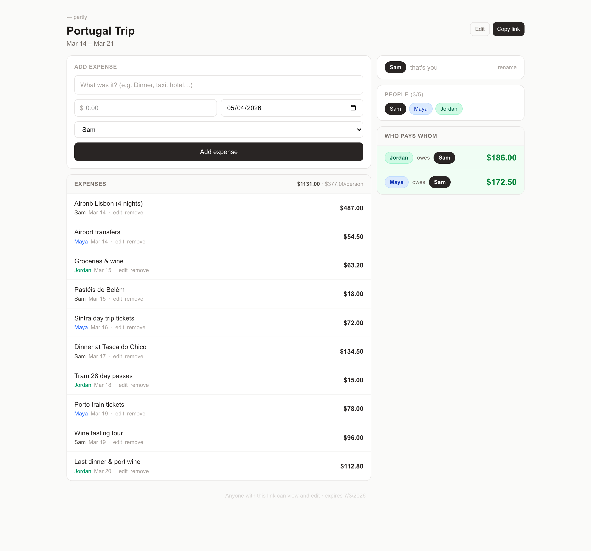

# partly

Dead-simple trip expense splitting for 2–5 people. No accounts, no logins — just a shareable link.

## Why partly?

Most expense-splitting apps make you create an account, install an app, or invite friends via email before you can record a single expense. partly gets out of the way:

| | **partly** | Splitwise | Tricount | Settle Up |
|---|---|---|---|---|
| Account required | No | Yes | No | Yes |
| Mobile app required | No | Optional | Yes | Yes |
| Works in any browser | Yes | Yes | No | No |
| Share via link only | Yes | No | No | No |
| Auto-deletes old data | Yes (60 days) | No | No | No |
| Self-hostable | Yes | No | No | No |
| Free | Yes | Freemium | Freemium | Freemium |

**The tradeoff:** partly is intentionally minimal. It has no push notifications, no currency conversion, no recurring expenses, and no long-term history. If you need those things, Splitwise is a solid choice. If you just want to split a weekend trip without the overhead, partly is for you.



## Features

- Create a trip and get a permanent URL to share with your group
- Auto-generated pseudonyms (e.g. "Swift Panda", "Brave Otter") — rename them to your real names
- Add expenses: who paid, how much, what for, which date
- Negative amounts for refunds
- Edit or delete any expense, with 5-second undo
- Settlement view showing the minimum transfers to square up
- Optional trip name and start/end dates
- Trips auto-delete 60 days after creation
- Anyone with the link can view and edit — no passwords

## Getting started

**Requirements:** Node.js 18+

```bash
git clone https://github.com/YOUR_USERNAME/partly.git
cd partly
npm install
npm run dev
```

Open [http://localhost:3000](http://localhost:3000).

Data is stored in a local SQLite file at `data/partly.db`, created automatically on first run.

## Running in production

```bash
npm run build
npm start
```

The `data/` directory must be writable and persisted between deploys (it is gitignored).

## Stack

- [Next.js 16](https://nextjs.org/) — App Router, API routes
- [Tailwind CSS v4](https://tailwindcss.com/)
- [better-sqlite3](https://github.com/WiseLibs/better-sqlite3) — embedded SQLite, no database setup needed
